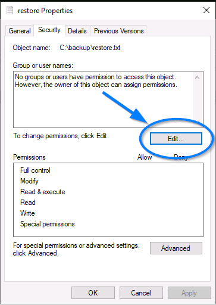

# ANTHEM

## Task 1: Website Analysis
Comenzaremos haciendo un escaneo con **nmap** para ver qué puertos están abiertos. En este caso, **80 (http)** y **3389 (RDP)**.

### (a) ¿Cuál es el puerto del servidor web?
Como podemos ver en la imagen anterior, es el puerto **80**, ya que es el de **http**.

**ANSWER:** 80

### (b) ¿Y para el Remote Desktop Service?
Es el puerto **3389**, el cual se utiliza normalmente para alojar este servicio.

**ANSWER:** 3389

### (c) ¿Cuál es una posible contraseña en una de las páginas que verifican los rastreadores web?
La página en la que deberemos buscar será con toda probabilidad **robots.txt**. Si miramos allí efectivamente encontraremos la contraseña que buscamos.

**ANSWER:** UmbracoIsTheBest!

### (d) ¿Qué CMS está usando el sitio web?
Ya hemos hallado la respuesta en el paso anterior, ya que **Umbraco** es el **CMS**.

**ANSWER:** Umbraco

### (e) ¿Cuál es el dominio del sitio web?
Si accedemos a la página principal, al final de la misma veremos que el dominio es **Anthem.com**.

### (f) ¿Cuál es el nombre del administrador?
Si accedemos al post **A cheers to our IT department** que hay en la página veremos que hay un **poema**.

Si buscamos ese poema en Internet veremos que su autor es **Solomon Grundy**, y al probar a introducir este nombre vemos que es la respuesta. Casualmente el autor del poema es también el creador de la página.

### (g) ¿Cuál es su email?
Si abrimos ahora el post **We are hiring** encontramos el correo de su autora, **Jane Doe**: **JD@anthem.com**.

Se entiende que este es un **correo corporativo** y por tanto el resto de mails tendrán el mismo formato. Si cogemos las iniciales de **Solomon Grudy** el correo resultante es **SG@anthem.com**. Y efectivamente esta es la respuesta.

## Task 2: Spot the flags
### Flag 1
Si vamos al código fuente del post **We are hiring** encontraremos la **Flag 1**.

### Flag 2
Si vamos al código fuente de la **página principal** encontraremos la **Flag 2**.

### Flag 3
Si volvemos al post **We are hiring** y pinchamos en el link con el nombre de **Jane Doe** encontraremos la **Flag 3**.

### Flag 4
Si vamos al código fuente del post **A cheers to our IT department** encontraremos la **Flag 4**

## Task 3: Final stage
### (a) Averigua el usuario y la contraseña
Ya tenemos las credenciales. De la pregunta del correo del administrador obtenemos el usuario **SG** y la contraseña es la que vimos en el robots.txt: **UmbracoIsTheBest!**

### (b) Accede al escritorio remoto. ¿Cuál es el contenido del fichero user.txt?
Para acceder utilizaremos **rdesktop** junto con nuestras credenciales.

Nada más acceder al escritorio encontraremos el fichero que buscamos y veremos su contenido.

### (c) Encuentra la contraseña de administrador.
Si vamos a la terminal en el escritorio remoto y hacemos `dir /a:hd` en el directorio **C:** podremos ver los **archivos ocultos** con un poco de suerte. Encontramos el directorio **backup**.

Si nos movemos a este directorio encontramos un fichero **restore.txt**. Lamentablemente no podemos acceder a su contenido.

No nos vamos a rendir. Accedemos a **C:** en el **explorador de archivos**, habilitamos la vista de **hidden items**, abrimos la carpeta **backup**, seleccionamos nuestro archivo **restore.txt** y cambiamos los **permisos** de forma que nuestro usuario **SG** tenga acceso al archivo. Una vez hecho esto podremos abrir el archivo normalmente y hallar la contraseña que buscamos.

### (d) Escala privilegios y hazte root. ¿Cuál es el contenido del fichero root.txt?
Sabiendo la contraseña de administrador podremos reloggearnos como tal. 

Nada más acceder al escritorio encontraremos el fichero que buscamos y veremos su contenido.

