# BLUE

## Task 1: Recon
En primer lugar realizaremos un **escaneo de puertos** con nmap:

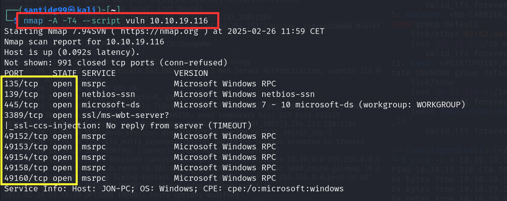
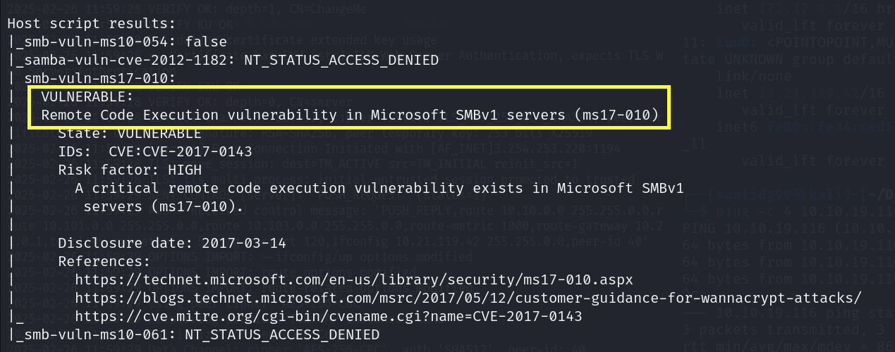

### (a) ¿Cuántos puertos con un número por debajo de 1000 hay abiertos?
Si miramos los resultados del **nmap** que acabamos de realizar veremos que hay **3** puertos abiertos que cumplen esta condición: **135**, **139** y **445**.

**ANSWER:** 3

### (b) ¿A qué es vulnerable esta máquina?
Si volvemos a mirar los resultados del **nmap** veremos que nuestra máquina objetivo presenta una vulnerabilidad de **remote code execution**, concretamente la **ms17-010**.

**ANSWER:** ms17-010

## Task 2: Gain Access
### (a) Exploit a utilizar contra la máquina
Iniciaremos **metasploit** y buscaremos un exploit sabiendo que nuestra máquina presenta la vulnerabilidad **ms17-010**.

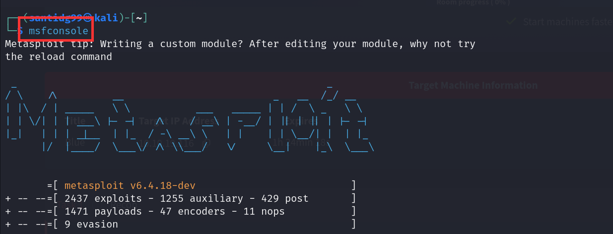
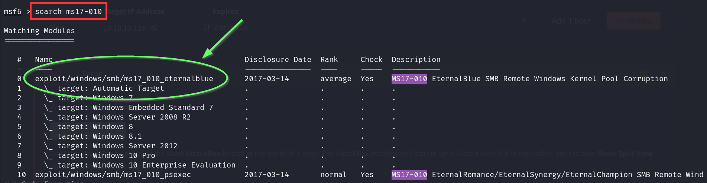

El **exploit 0** es el que buscamos.

**ANSWER:** exploit/windows/smb/ms17_010_eternalblue

### (b) ¿Qué opción hay que configurar antes de lanzar el exploit?
Hacemos **`use 0`** y luego **`options`** para ver que la opción que debemos establecer es **`rhosts`**. 

### (c) Introduce el payload a utilizar y luego ejecuta el exploit.
Establecemos `rhosts` si todavía no lo hemos hecho, `lhost` (IP VPN Tryhackme), `payload` (windows/x64/shell/reverse_tcp) y ejecutamos el exploit.

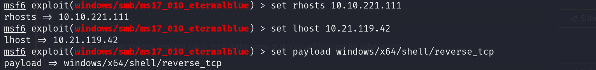
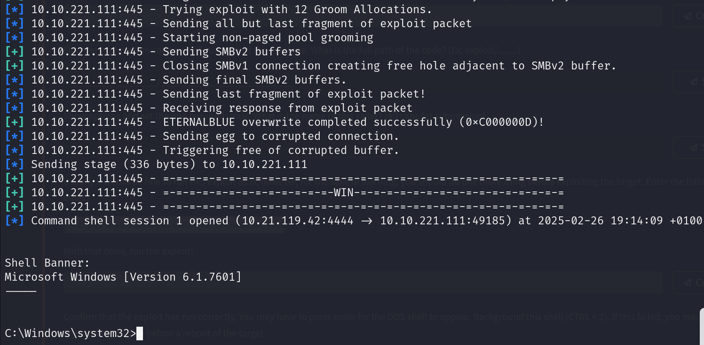

## Task 3: Escalate
### (a) Ejecuta el comando `background`. Ahora busca un modo de convertir nuestra shell en una meterpreter de metasploit ¿Cuál es el post module que utilizaremos?
Primero ponemos nuestra sesión en segundo plano con `background` (ó **ctrl+Z**). Ahora buscaremos un exploit, con el comando `search`, para convertir nuestra shell a una **meterpreter**. El exploit que buscamos es 

**ANSWER:** post/multi/manage/shell_to_meterpreter

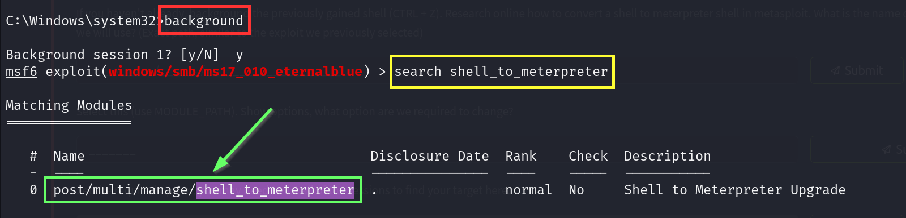

### (b) Usa este exploit y consulta las opciones. ¿Cuál tenemos que establecer?
Seleccionamos el exploit (**`use 0`**) y mostramos sus opciones. Veremos entonces que hay que establecer

**ANSWER:** SESSION

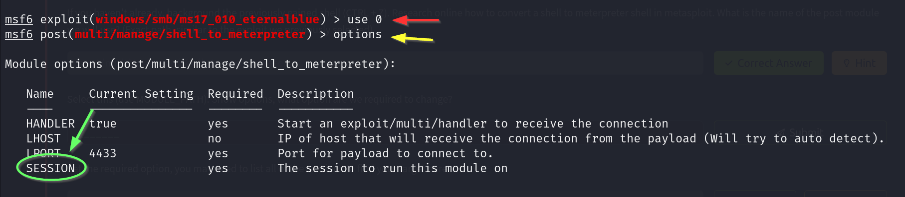

### (c) Establece la sesión dejada en segundo plano y ejecuta el exploit.
Establecemos la **sesión 1** dejada en segundo plano y ejecutamos este exploit.

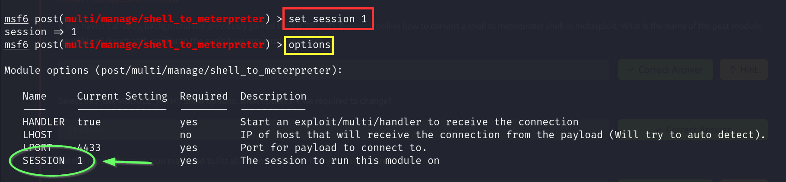
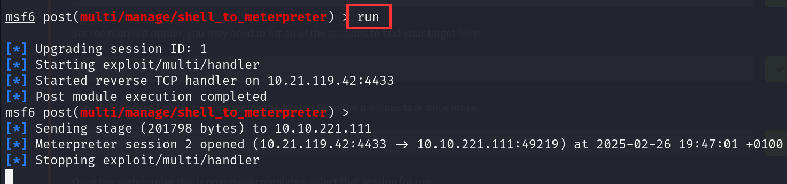

Si pulsamos ENTER y escribimos `sessions -l` veremos que se ha creado una nueva sesión. Si accedemos a ella obtendremos nuestra **shell de meterpreter con privilegios de administrador**.

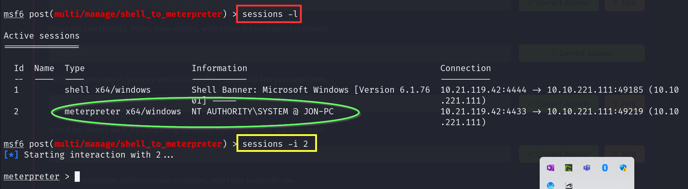

Si ahora escribimos `shell` y después `whoami` confirmaremos que somos **root**.

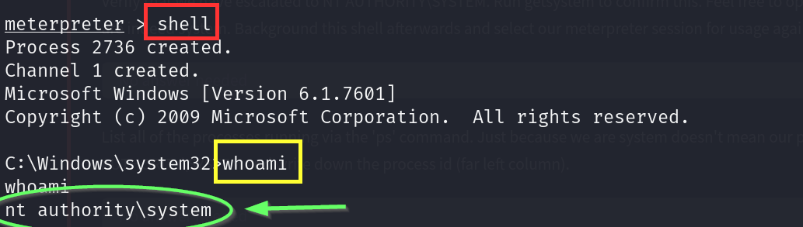

### (d) Lista todos los procesos en ejecución y elige uno (de administrador) al que migrar.
Para hacer esto deberemos hacer **ctrl+C** en primer lugar para volver a **meterpreter**. Luego introducimos `ps`.

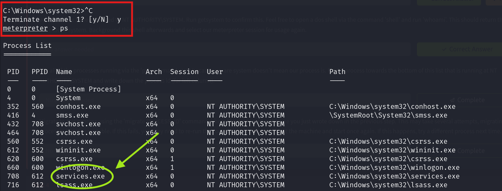

En nuestro caso intentaremos migrar al proceso **services.exe**. Haremos esto mediante el comando `migrate <process-id>`.

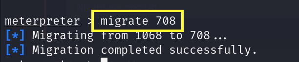

## Task 4: Cracking
### (a) Ejecuta el comando `hashdump`. ¿Cuál es el nombre del non-default user?
Al ejecutar el comando `hashdump` nos aparece que el nombre del non-default user es

**ANSWER:** Jon

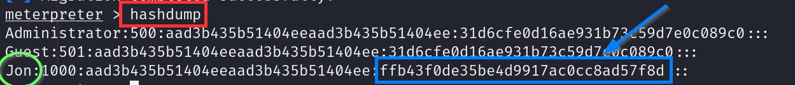

### (b) Copia el hash de su contraseña y crackealo. ¿Cuál es la contraseña?
Copiamos el último campo del hash y nos lo llevamos a la web de **crackstation**, que tiene una base de datos con multitud de contraseñas hasheadas. La contraseña es:

**ANSWER:**  alqfna22

## Task 5: Find flags!
### Flag 1: Busca en system root
Ejecutamos el comando `shell`, nos movemos al system root y hacemos `dir`, lo que nos permitirá encontrar un archivo llamado **flag1.txt**.

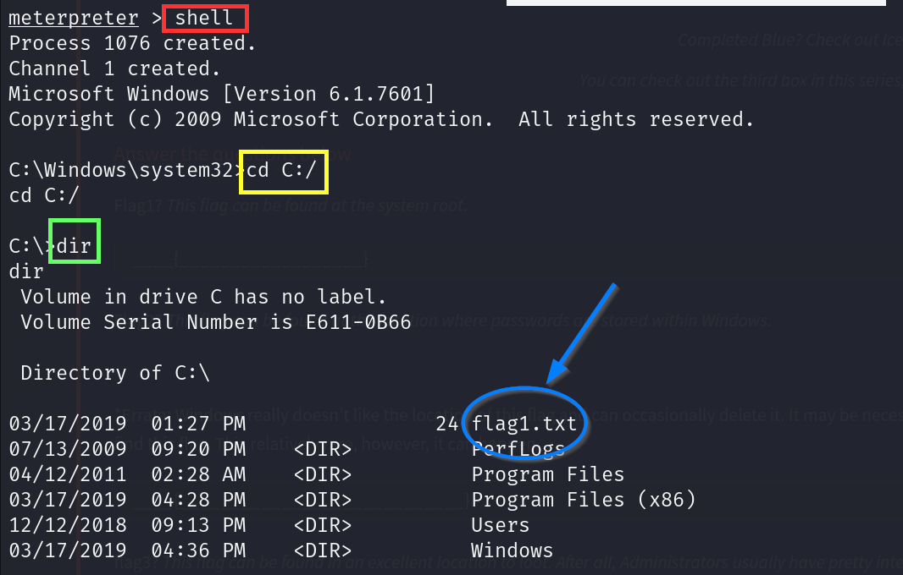

Si mostramos el contenido de este archivo con `type` obtendremos la **primera flag**.

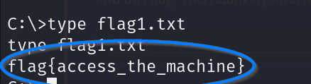

### Flag 2: Busca donde Windows almacena las contraseñas
En Windows, las contraseñas se almacenan en **C:Windows\system32\config**. Si nos movemos ahí y hacemos `dir` encontraremos un archivo llamado **flag2.txt**.

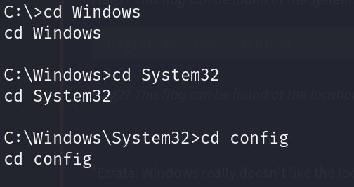
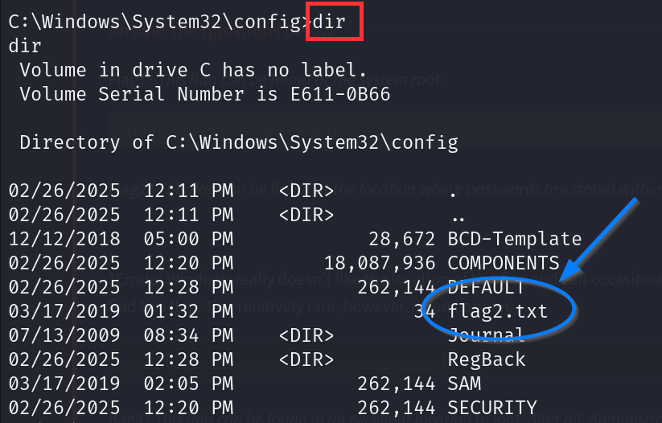

Si mostramos el contenido de este archivo con `type` obtendremos la **segunda flag**.

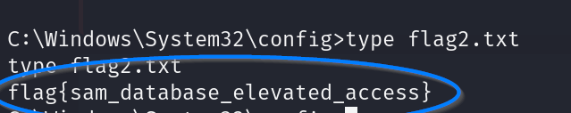

### Flag 3
Si nos movemos al directorio **Users** y hacemos `dir` nos encontramos con el usuario **Jon**, que apunta a ser administrador. Entonces, si rebuscamos en su usuario, y concretamente en **Documents**, encontraremos el archivo **flag3.txt**.

Si mostramos el contenido de este archivo con `type` obtendremos la **tercera flag**.

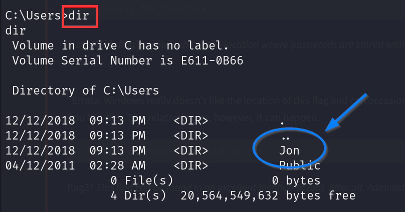
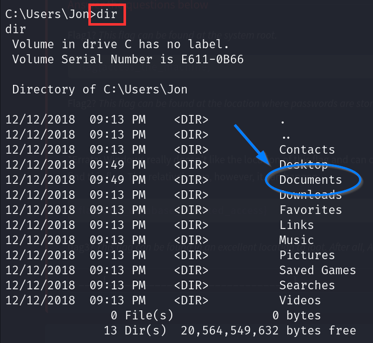
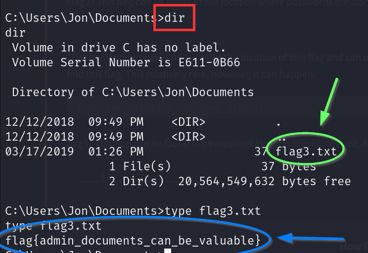

