# BOLT

### (a) ¿En qué puerto está el servidor Web con CMS?
Hacemos un escaneo con **nmap** y vemos que el puerto buscado es el **8000**.

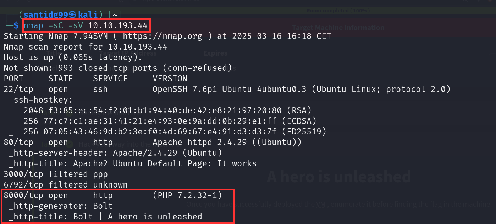

Podemos verificarlo accediendo a él en el **navegador**.

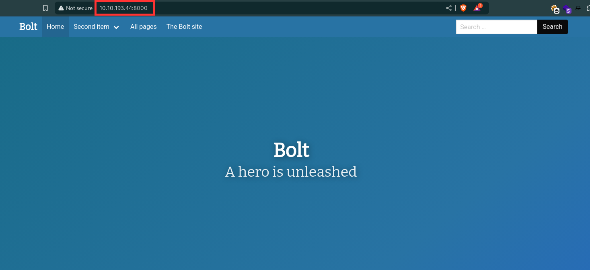

**ANSWER:** 8000

### (b) ¿Qué nombre de usuario podemos encontrar en la web?
Si navegamos un poco por la pestaña **Home** encontraremos la información que buscamos.

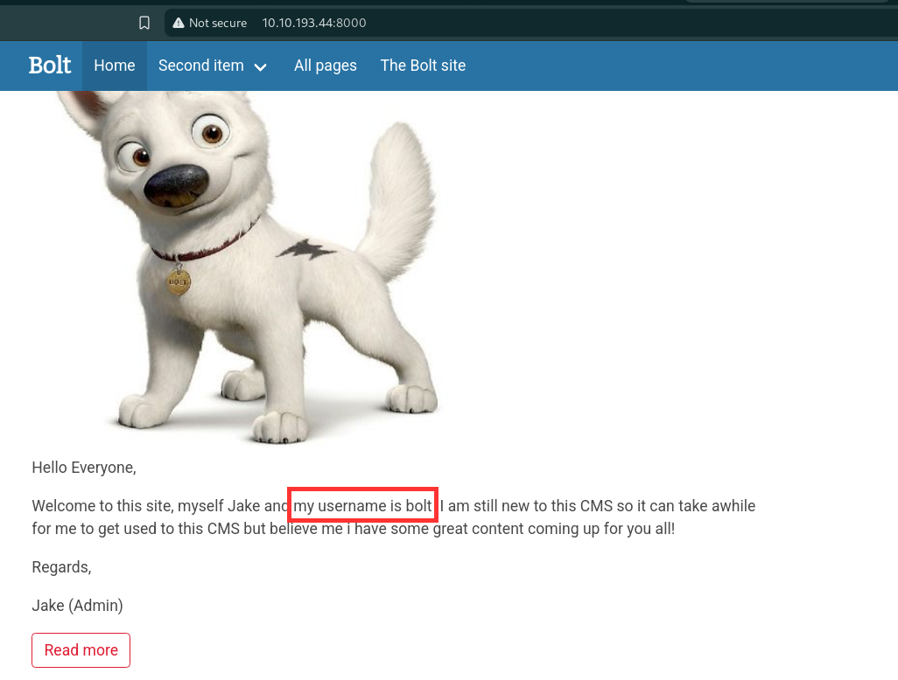

**ANSWER:** bolt

### (c) ¿Cuál es su contraseña correspondiente?
Si miramos un poco más arriba encontraremos la contraseña buscada.

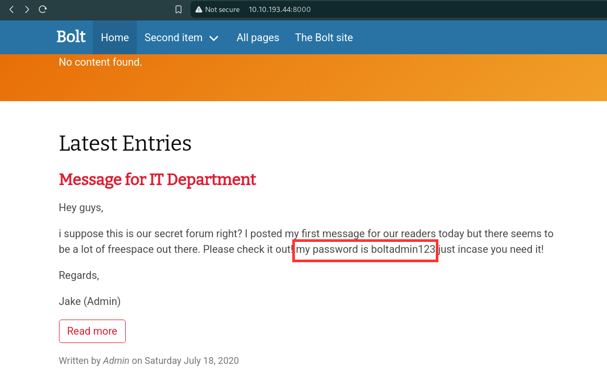

**ANSWER:** boltadmin123

### (d) ¿Qué versión de CMS está instalada en el servidor?
Investigando un poco encontramos que el enlace a la **página de login de Bolt CMS** es de la forma **http://yourdomain.com/bolt**.

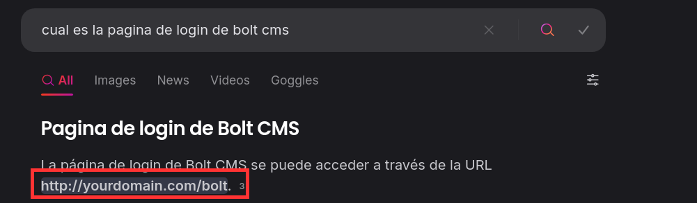

Así que cambiando **yourdomain.com** por **[IP-THM]:8000** encontraremos dicha página, e introduciendo las credenciales de acceso que hemos encontrado accederemos al **dashboard**, donde encontraremos la información sobre la **versión de CMS**.

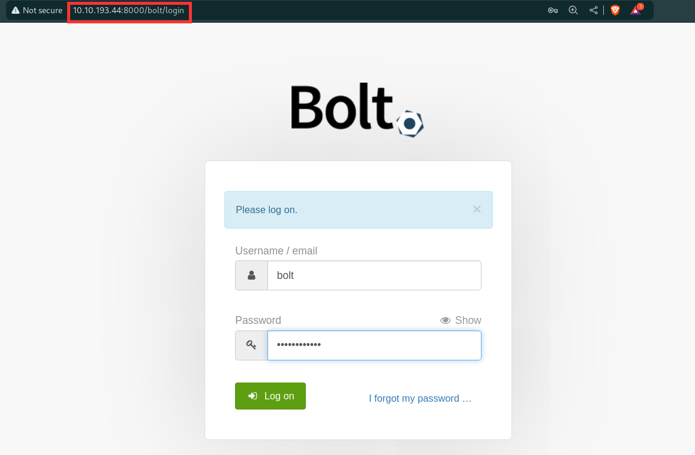

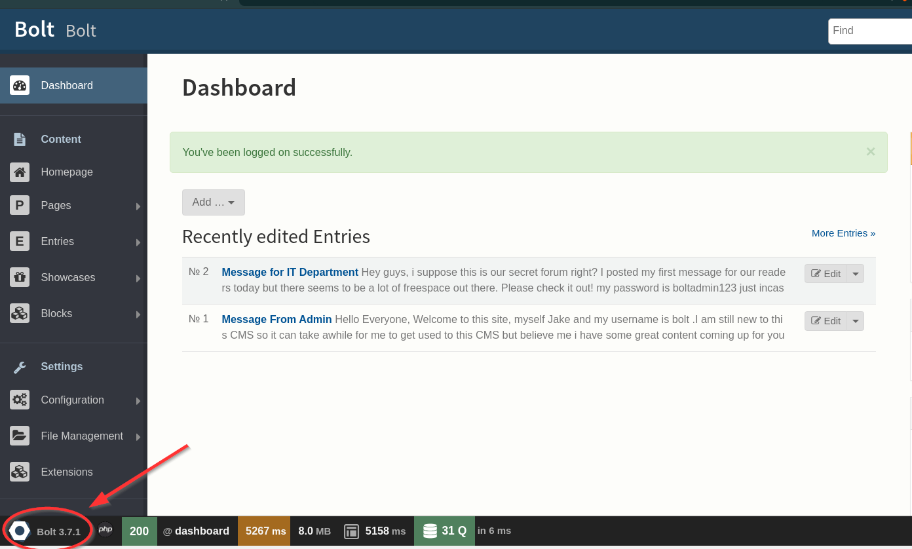

**ANSWER:** Bolt 3.7.1

### (e) Existe un exploit para una versión previa de este CMS, que permite realizar authenticated RCE. ¿Cuál es su ID en Exploit-DB?
Si vamos a **Exploit-DB** y buscamos **bolt**, encontraremos el exploit que buscamos, cuyo ID es **48296**.

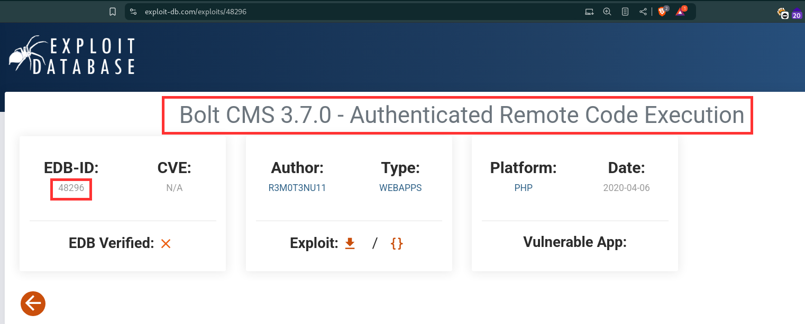

**ANSWER:** 48296

### (f) Metasploit añadió recientemente un exploit module para esta vulnerabilidad. ¿Cuál es su path completo?
Si abrimos la **consola de Metasploit** y escribimos **search bolt** encontraremos el exploit que buscamos, junto con su **path completo**

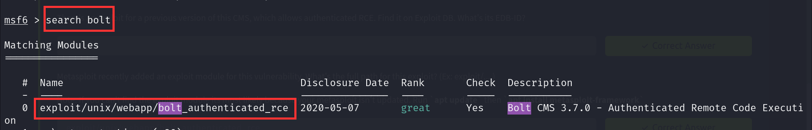

**ANSWER:** exploit/unix/webapp/bolt_authenticated_rce

### (g) Configura el exploit y ejecútalo.

Para ello hacemos **use 0** y posteriormente indicamos **LHOST (IP-VPN)**, **LPORT (el que queramos)**, **RHOST (IP-THM)**, **USERNAME** y **PASSWORD**. 

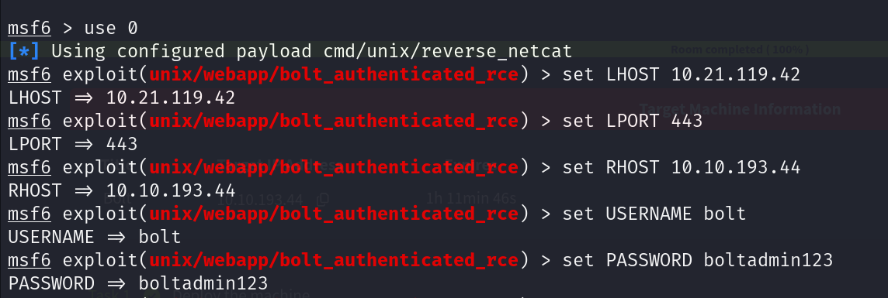

Por último hacemos **run**.

Con esto hemos conseguido entrar en la **máquina objetivo**.

### (h) Busca el archivo flag.txt
Si ejecutamos el comando **id** veremos que somos **root**.

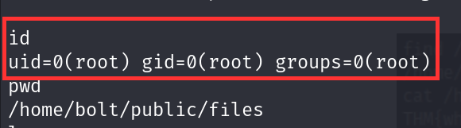

Haciendo uso a continuación de los comandos **find** y **cat** podremos acceder al contenido del archivo **flag.txt**, que es la respuesta a la última pregunta del THM.

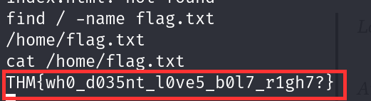

