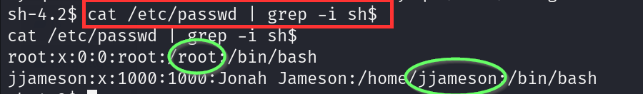
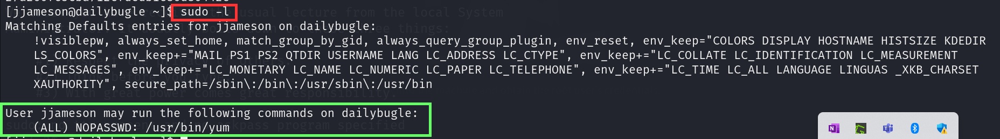

## Task 1
### (a) ¿Quién ha robado el banco?
 

Ponemos **[IP_THM]:80** en el navegador y vemos que el ladrón es **spiderman**.

 

**ANSWER:** spiderman

## Task 2
### (a) ¿Cuál es la versión de Joomla?
Si hacemos **joomscan** a nuestra dirección IP veremos que la versión es la **3.7.0**.

 
 

**ANSWER:** 3.7.0

### (b) Jonah's cracked password
Si realizamos la siguiente búsqueda en nuestro navegador:
**`Joomla 3.7.0 exploit site:github.com intext:.py`**
Encontramos un repositorio de github del que descargaremos el exploit que necesitamos.

 
 
 

Y al ejecutarlo encontramos el usuario **jonah**, su correo y el **valor hash de su contraseña**.

 

Ahora insertaremos ese valor hash en un archivo, descubriremos qué tipo de hash tenemos con **hashid** y utilizaremos **John the Ripper** junto con el diccionario **rockyou.txt** para crackear dicho hash.

 
 
 

**ANSWER:** spiderman123

### (c) User Flag
En primer lugar nos loggearemos en la **página de administrador** utilizando las credenciales que hemos encontrado:

 

Una vez dentro, iremos a la sección de **Templates**, donde encontraremos dos diferentes: **Beez3** y **protostar**.

 

 

Luego accedemos a **Extensions > Templates > Templates** y seleccionamos **Protostar Details and Files**.

 

Ahora cambiaremos el código del **index.php** por el código de una reverse shell de **PentestMonkey** para PHP, poniendo la **IP** de la VPN de THM y el **puerto 1234**. 

 

Pulsamos el botón **Save** que aparece arriba a la izquierda y acto seguido volvemos a nuestra terminal, ponemos el puerto **1234** en escucha con **Netcat** y pulsamos el botón **Template preview** en la web. Con esto obtendremos nuestra **reverse shell**.

Si introducimos **whoami** veremos que somos **apache user**.

 

A continuación veremos qué usuarios hay en la máquina con `/etc/passwd`. Vemos que hay 2 usuarios: **root** y **jjameson**.

 

Si ahora nos vamos al directorio  **/var/www/html** y hacemos **`ls -la`** nos aparecerá un archivo **configuration.php**. Si vemos su contenido con el comando **`cat`** encontraremos una **contraseña**.

 

 

Si probamos a hacer **ssh** con el usuario **jjameson** y esa contraseña podremos obtener acceso como dicho usuario. Haciendo **ls** encontraremos el archivo **user.txt**, cuyo contenido es la **user flag** que buscamos.

 

### (d) Root Flag
Escribimos **`sudo -l`** para buscar comandos que nos permitan **escalar privilegios**. Vemos que **jjameson** puede ejecutar el comando **/usr/bin/yum** con privilegios de root sin necesidad de introducir contraseña.

 

Si buscamos información acerca de este comando encontraremos una página de **Gtfobins** en la que encontramos un código que podemos utilizar para spawnear una **interactive root shell**.

 
 

Copiamos todo ese código y con ello nos haremos **root**.

 

Una vez hecho esto nos movemos al directorio **/root**, donde encontraremos el archivo **root.txt**. Su contenido es la **root flag** que buscamos.

 

