# IGNITE

### User.txt
Empezamos realizando un escaneo con **nmap**, el cual nos permite ver que el puerto **80** está abierto y aloja un **servidor web**.

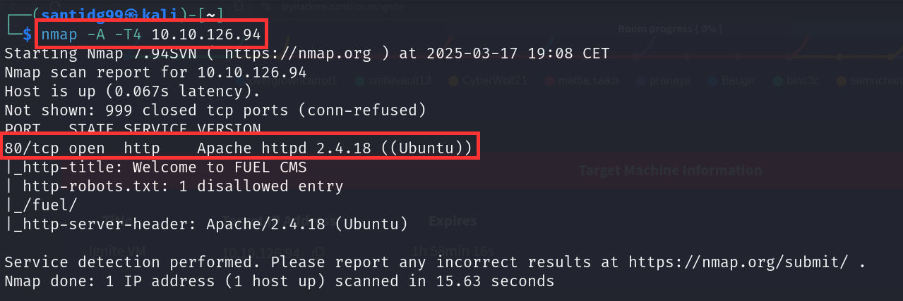

Si accedemos a la web y navegamos un poco encontraremos un enlace al directorio **/fuel** y unas **credenciales de acceso**.

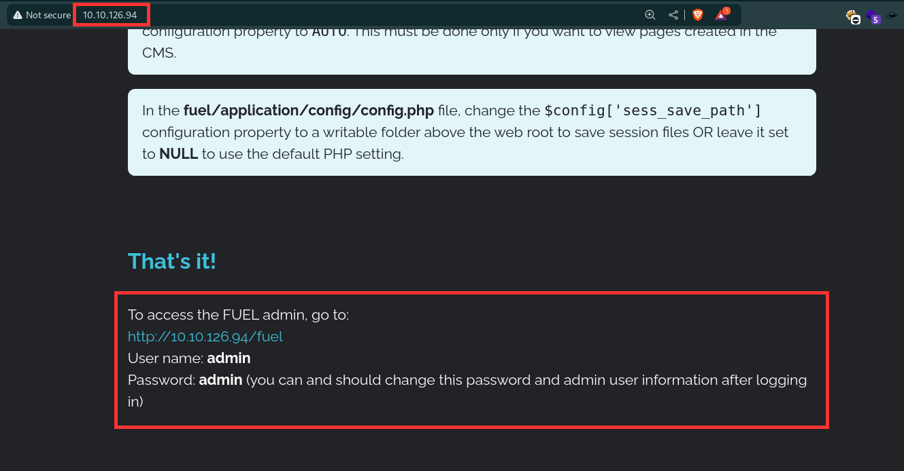

Ese enlace nos llevará a un **formulario de login**. Si introducimos las credenciales que acabamos de ver obtendremos acceso a un **dashboard**.

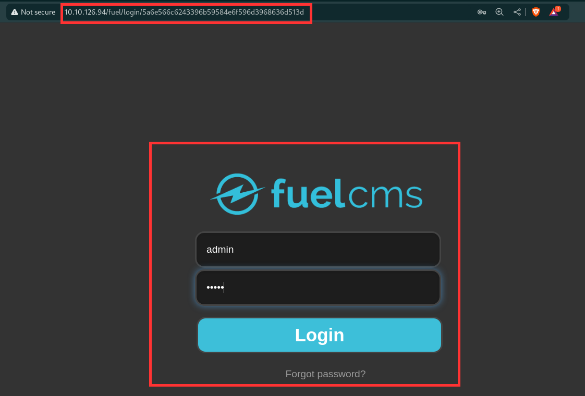

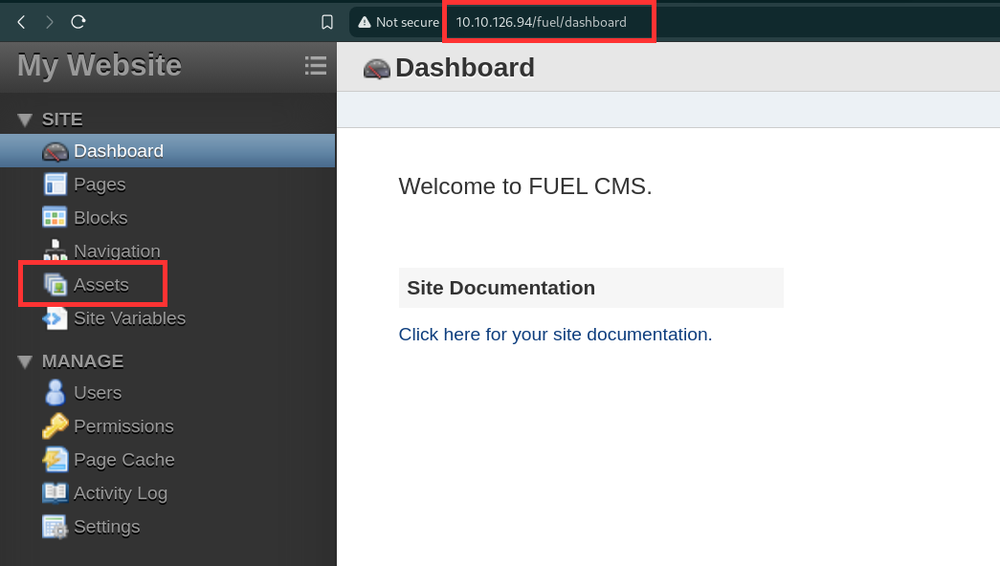

Si vamos ahora a **assets** veremos que allí tenemos la opción de **subir archivos**.

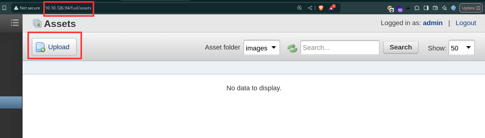

Vamos entonces a intentar subir una **reverse shell** de **PentestMonkey** para meternos en la **máquina objetivo**.

Lamentablemente no podemos subir el archivo **.php** directamente, pero vemos que se nos da la opción de descomprimir cualquier **archivo zip** que buscamos.

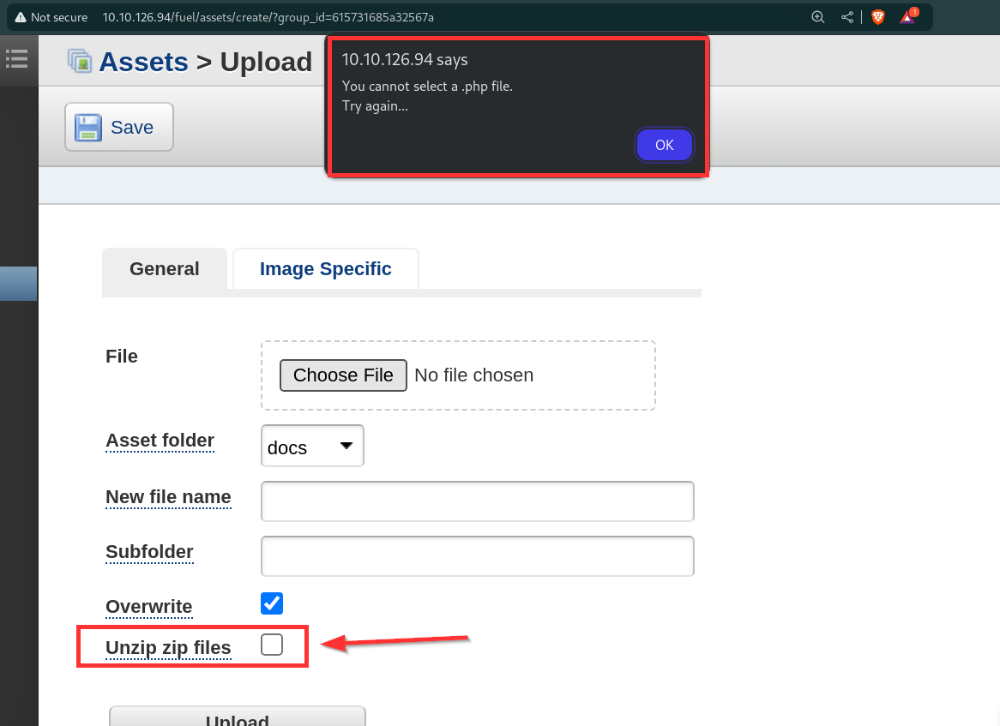

Entonces si guardamos nuestro archivo de **reverse shell** en un **zip** y marcamos esa opción veremos que el archivo se sube correctamente.

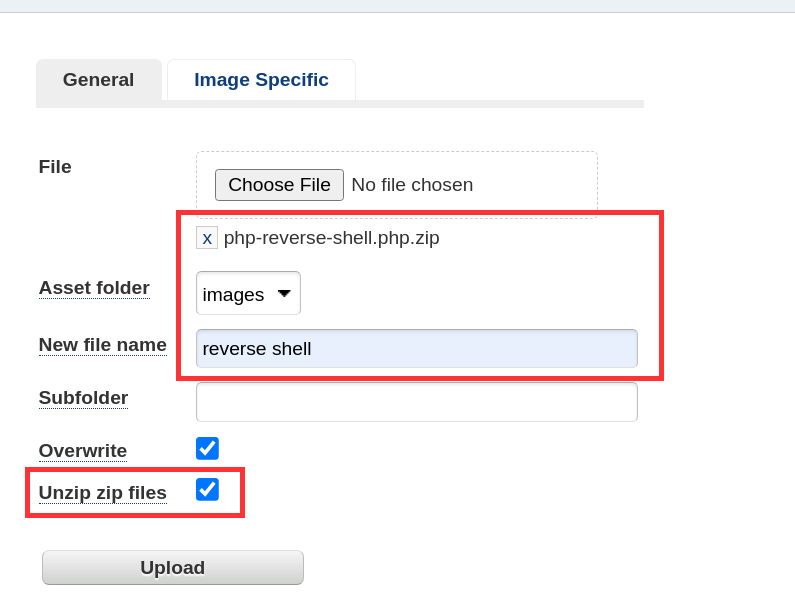

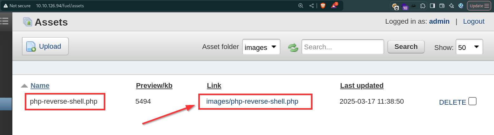

Ahora pondremos en escucha el puerto que hayamos indicado en el archivo de la **reverse shell** (en nuestro caso el **4444**) y al hacer clic en el enlace de la shell que hemos subido a la página conseguiremos acceder al sistema como **user**.

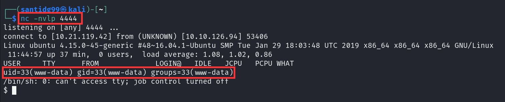

Si navegamos al directorio de **www-data** y hacemos **ls** encontraremos el archivo **flag.txt**, cuyo contenido es la **user flag**.

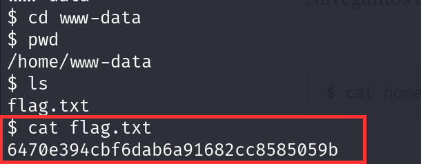

### Root.txt
Ahora intentaremos **escalar privilegios** para poder tener acceso a la **root flag**.

Antes de probar nada volveremos a la web principal a ver si encontramos algo de utilidad, y nos topamos con esto: se nos da la ruta al fichero **database.php**, el cual contiene la **configuración de la base de datos**.

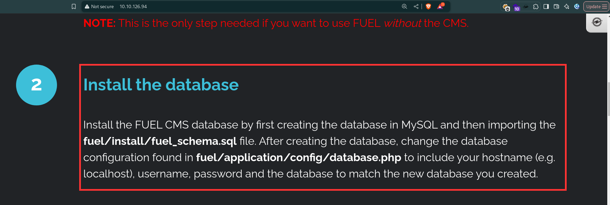

Si accedemos a dicho fichero encontraremos las credenciales del **root**.

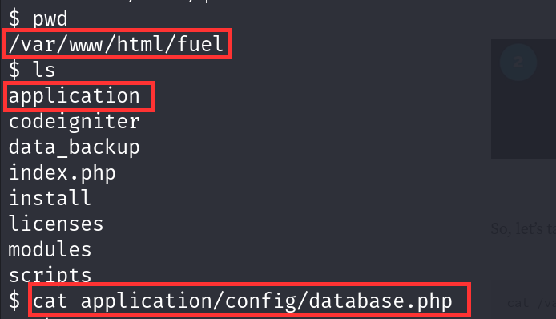

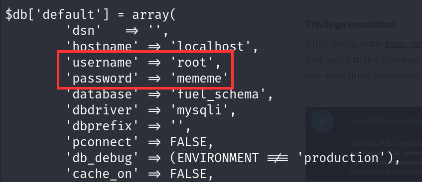

Ahora intentaremos hacer login como **root** usando esas credenciales. 

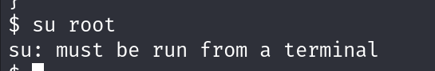

Vemos que nuestro primer intento es **fallido**, pero esto es porque necesitamos una terminal propia del sistema. Para ello ejecutaremos el siguiente comando:

```shell
python -c 'import pty; pty.spawn("/bin/bash")'
```

Una vez hecho esto volvemos a intentar **hacer login como root**, esta vez con éxito, vemos con el comando **find** dónde se encuentra el archivo **root.txt** y mostramos su contenido con el comando **cat** para obtener la **root flag**.

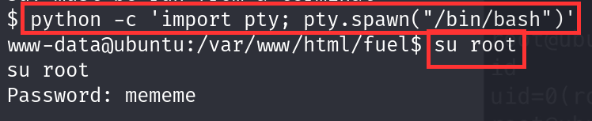

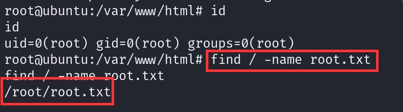

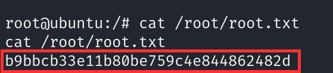


