# LIBRARY

## User.txt
En primer lugar obtenemos **la IP de THM** y hacemos un **ping** y un **nmap**. Gracias al **nmap** vemos que los puertos **SSH** y **HTTP** están abiertos.

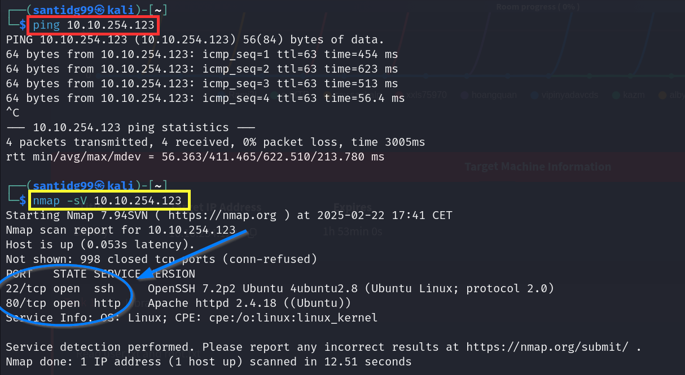

Ahora realizaremos un **feroxbuster** para encontrar **directorios ocultos**. Lo único interesante que podemos encontrar son los directorios **images** y **robots.txt**.
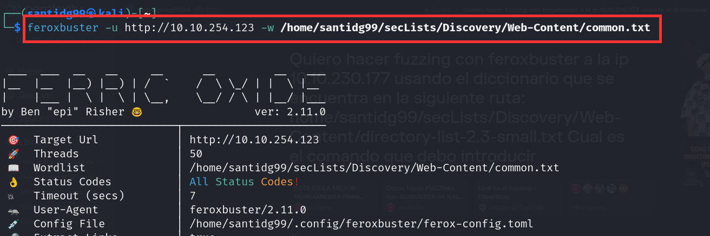
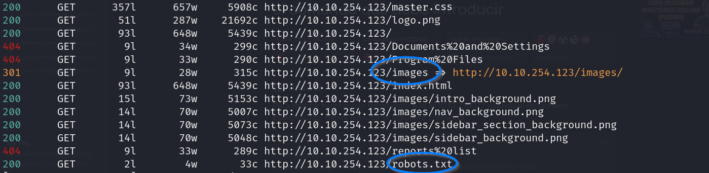

Si visitamos la web (ponemos la IP en brave) encontramos un post del usuario **meliodas** y tres comentarios de **root**, **www-data** y **Anonymous**.
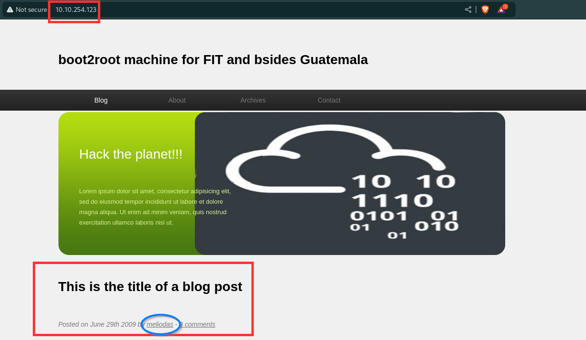
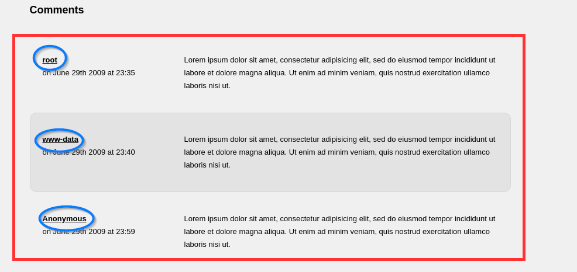

Abrimos ahora el directorio **robots.txt** en el navegador y encontramos la siguiente información. 
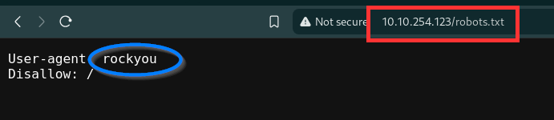

Esta es una pista que nos indica que debemos usar el diccionario **rockyou.txt** para encontrar una contraseña. Probemos a usar **hydra** empleando el usuario **meliodas**. Efectivamente obtenemos la contraseña.
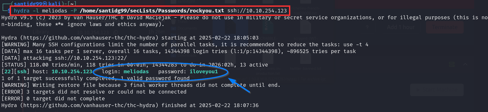

Ahora que tenemos la contraseña hacemos **ssh** a la máquina y obtenemos la **user flag**.
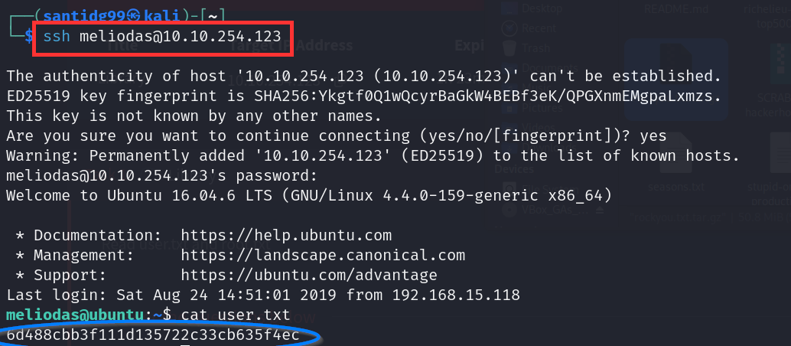

## Root.txt
En primer lugar miraremos los permisos **sudo** que posee nuestro usuario **meliodas**. 
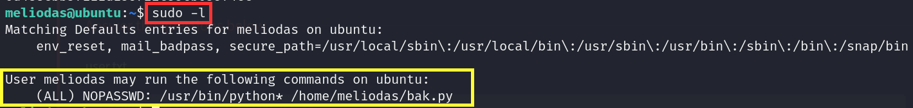

Vemos que podemos usar **python** para ejecutar un script llamado **bak.py**. Veamos qué contiene `nano bak.py`
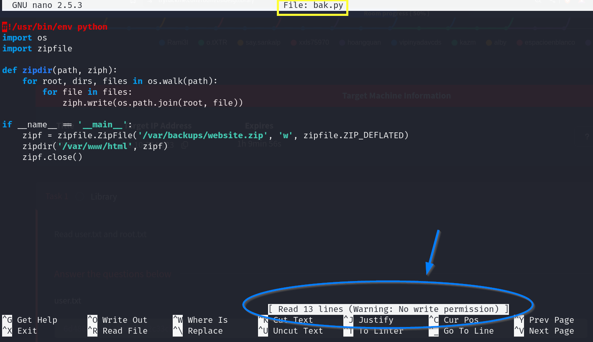

Lamentablemente no podemos introducir ahí nuestra **shell** ya que no tenemos **permiso de escritura**. 

Lo que haremos será **eliminar este script**, **crear uno nuevo** e **introducir ahí nuestro exploit**.
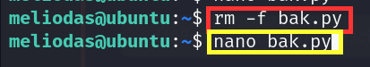
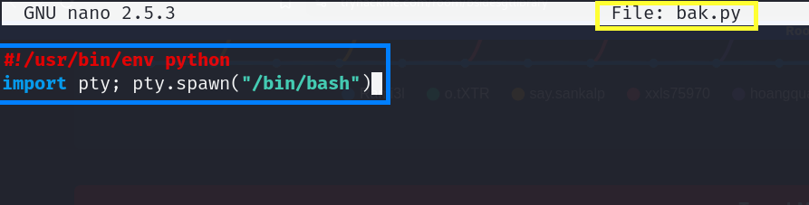
**(ctrl+O, Enter, ctrl+X)**

Ahora ejecutaremos el código para hacernos **root**.
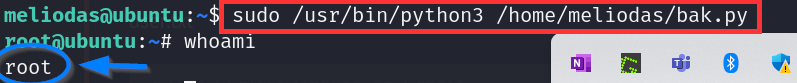

Por último nos movemos al directorio **root** y obtenemos la **flag**.
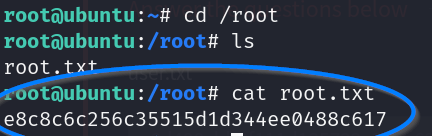

