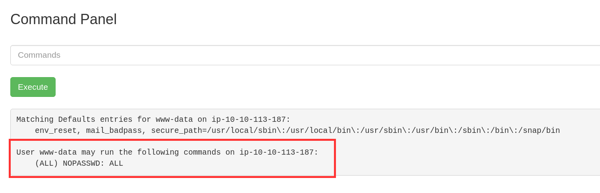

# PICKLE RICK

### First Ingredient
En primer lugar realizamos un escaneo con **nmap** y encontramos **2** puertos abiertos: **22 (SSH)** y **80 (servidor Web)**.

Si accedemos al **servidor web** y miramos el **código fuente** encontraremos un **username**.

Si ahora hacemos **fuzzing** con **gobuster** encontraremos **3** archivos interesantes: **login.php**, **portal.php** y **robots.txt**.

Si accedemos en primer lugar al **robots.txt** encontraremos lo que parece ser una **contraseña** para el **username** que encontramos antes.

Si vamos ahora al **login.php** e introducimos ese par **username/contraseña** obtendremos acceso al **portal.php**.

Si escribimos ahora **ls -a** en el **Command Panel** veremos una lista de archivos, entre los que destaca **Sup3rS3cretPickl3Ingred.txt**.

Lamentablemente no podemos acceder a su contenido usando **cat**, así que tendremos que buscar otra alternativa.

Investigando un poco descubrimos que también podríamos utilizar el comando **less**. Probamos y listo, ya tenemos nuestro **first ingredient**.

**ANSWER:** mr.meeseek hair

### Second Ingredient
En la lista de archivos anterior había otro archivo llamado **clue.txt**, que como su nombre indica podría darnos alguna pista que nos ayude a continuar. Si accedemos a su contenido utilizando **less** nos aparecerá lo siguiente.

Luego tendremos que movernos por los diferentes directorios para encontrar un nuevo ingrediente.

Probaremos en primer lugar con el directorio **/home**. Si hacemos **ls** veremos que contiene **dos directorios de usuario**: **rick** y **ubuntu**.

Si miramos en el directorio **rick** encontraremos el archivo **second ingredients**.

Si visualizamos su contenido con **less home/rick/"second ingredients"** encontraremos la segunda respuesta.

**ANSWER:** 1 jerry tear

### Third Ingredient
Si introducimos el comando **whoami** veremos que somos el user **www-data**, que parece no ser **root**.

Sin embargo, si introducimos el comando **sudo -l** veremos que nuestro user **puede ejecutar cualquier comando como root sin necesidad de contraseña**. 

Entonces, simplemente utilizando el prefijo **sudo** podremos ver todo el contenido del directorio **root**, donde encontraremos el archivo **3rd.txt**.

Si visualizamos el contenido de este archivo con **sudo less /root/3rd.txt** encontraremos el **tercer y último ingrediente**.

**ANSWER:** fleeb juice

