# RELEVANT

## User Flag
En primer lugar haremos un **ping** para comprobar que tenemos conexión y luego realizaremos un escaneo con **nmap** para ver los **puertos abiertos**.

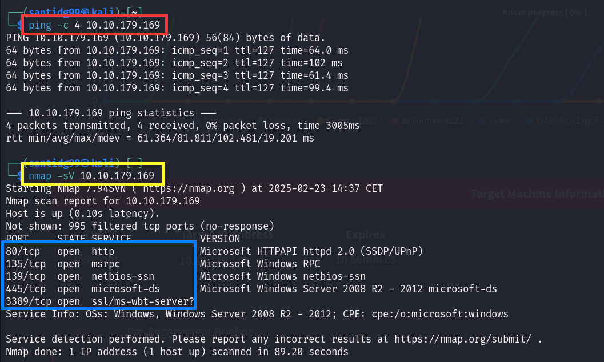

Veremos que el puerto **445**, el cual utiliza el servicio **Samba**, está abierto, así que a continuación ejecutaremos el comando **smbclient** para ver los dispositivos conectados a esta red.

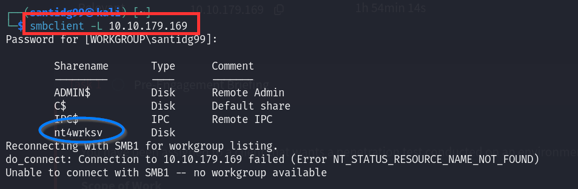

Puesto que inmediatamente **nt4wrksv** nos llama la atención accederemos a él y entraremos a **Samba**, ejecutaremos **ls** para listar **directorios y archivos** y encontraremos un archivo llamado **passwords.txt**.

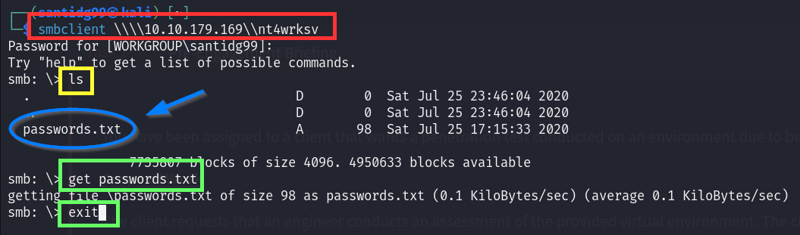

Obtendremos este archivo con **get**, saldremos con **exit** y al mostrar el contenido del archivo con **cat** veremos información codificada de usuario y contraseña **(User Passwords - Encoded)**. Si tomamos ambas líneas y les aplicamos **decodificación de base 64** obtendremos **nombres de usuario y contraseñas**.

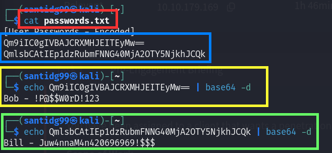

Lo que intentaremos ahora será obtener una **reverse shell** a la máquina objetivo. Para ello obtendremos una **aspx reverse shell** con **msfvenom** y la cargaremos en **Samba**.

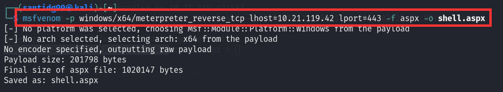

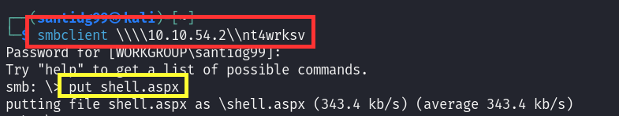

Una vez hecho esto abriremos **otra terminal**, iniciaremos **metasploit** y usaremos el exploit **exploit/multi/handler**. Una vez configuradas correctamente la **IP de nuestra máquina (LHOST)**  y el puerto **443 (LPORT)**, que es el que pusimos en escucha anteriormente en el comando **msfvenom**, ejecutaremos el **exploit** y haremos el **curl** que aparece en la imagen. Se nos abrirá una **shell meterpreter** y habremos obtenido acceso a la **máquina objetivo**.

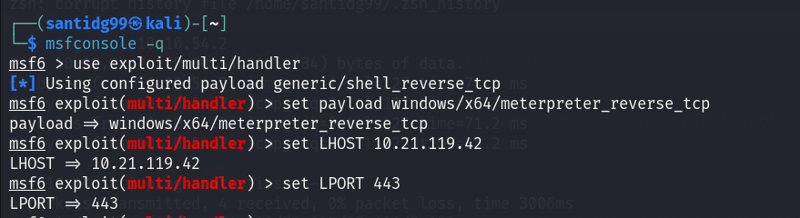

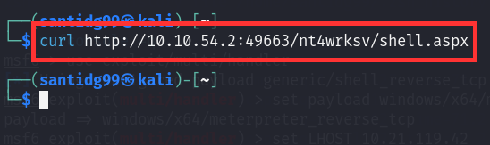

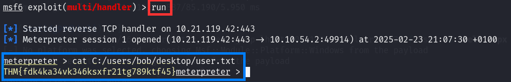

Entonces, sabiendo que existe el usuario **bob**, nos moveremos hasta su directorio y luego a **desktop**. Haciendo entonces **dir** encontraremos el archivo **user.txt**. Si visualizamos su contenido con **cat** encontraremos la **User Flag**.

## Root Flag
Lo que haremos ahora será ejecutar **getprivs** para ver qué acciones podemos realizar. Encontraremos el privilegio **SeImpersonatePrivilege**, que nos permite impersonar al usuario tras la autenticación.

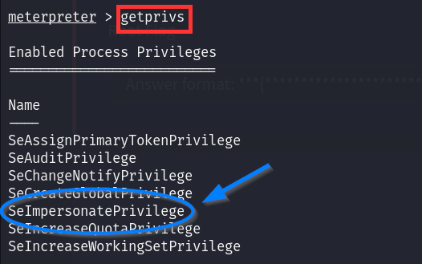

Puesto que tenemos este privilegio podemos utilizar el ejecutable **PrintSpoofer** para escalar privilegios. Lo descargamos del repositorio de **Github** con **wget**, volvemos a **nt4wrksv** en **Samba**, lo cargamos allí y hacemos **dir** para comprobar que efectivamente se ha subido.

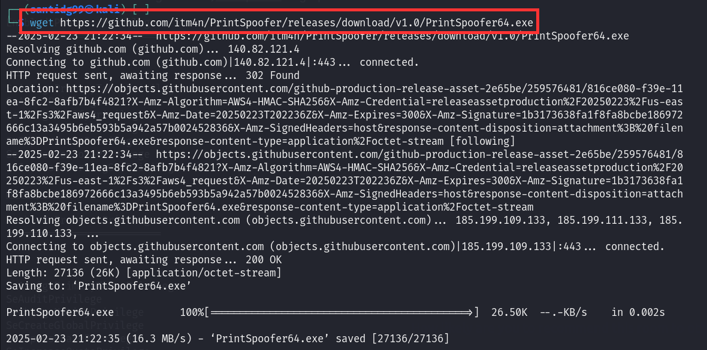

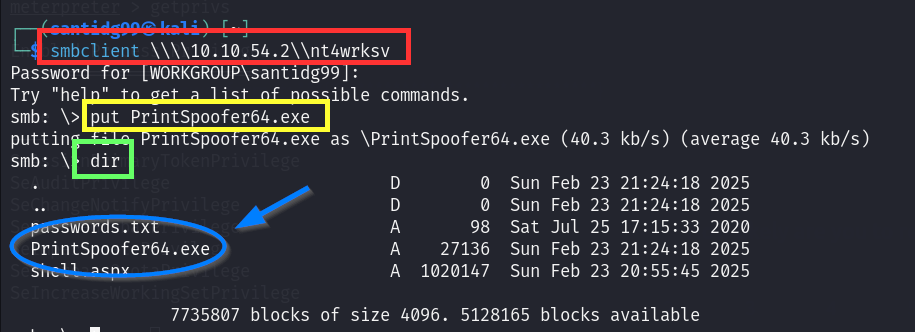

Una vez hecho esto volvemos a **meterpreter** y ejecutamos el comando **shell** para acceder a la **terminal del sistema objetivo**.

Nos movemos al directorio **nt4wrksv** (hay que rebuscar un poco), hacemos **dir** una vez más para comprobar que tenemos disponible el ejecutable **PrintSpoofer** y lo ejecutamos.

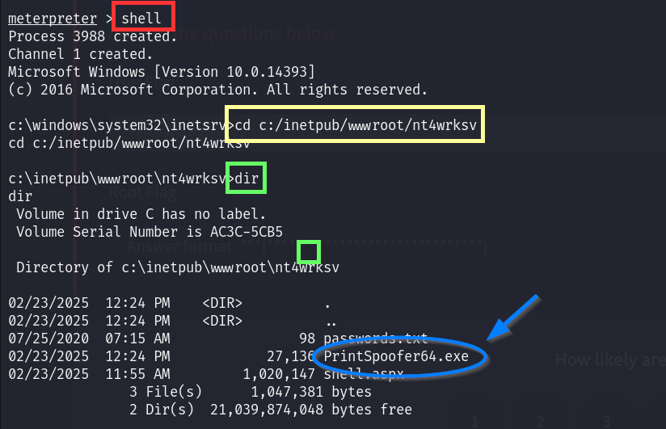

Si hacemos **whoami** veremos que ya somos **administrador**. Nos movemos a **\users\administrator\desktop** y hacemos **dir**, encontrando el archivo **root.txt**. Si visualizamos su contenido con **cat** encontraremos la **Root Flag**.

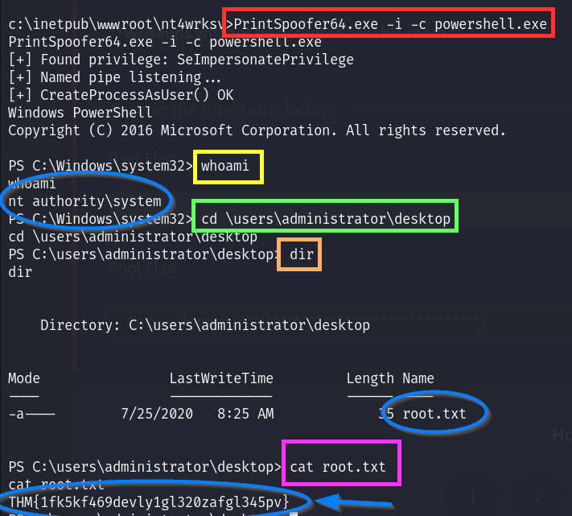

