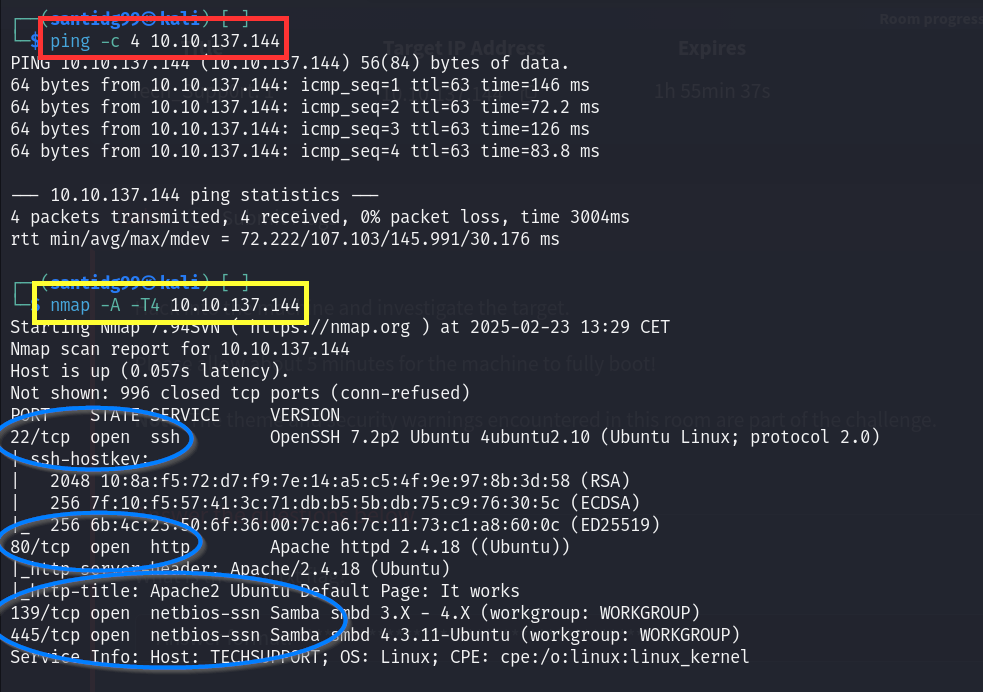
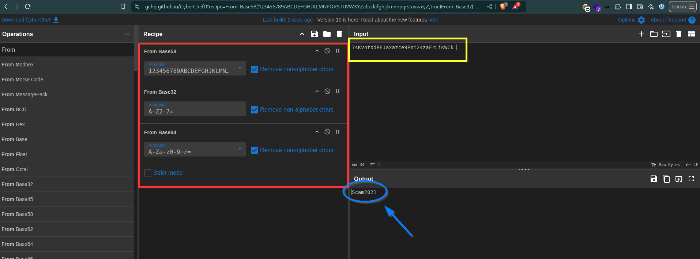
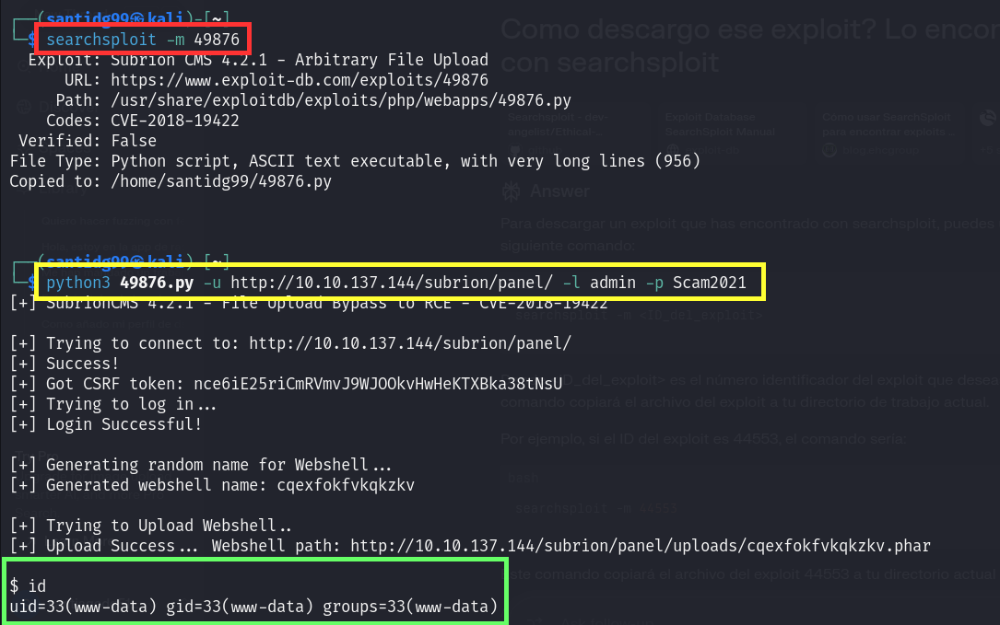

# TECHSUPP0RT1

## root.txt
Empezamos obteniendo la **IP de THM**, haciéndole **ping** y después **nmap**. Encontramos varios puertos abiertos: **22 (SSH)**, **80 (HTTP)**, **139 y 445 (Samba)**

Si ponemos la IP en el navegador veremos que en el **puerto 80** se está corriendo **Apache2 Ubuntu Default Page**.

Si hacemos fuzzing con **feroxbuster** encontraremos 2 directorios que no nos sirven para nada, así que en su lugar examinaremos **SMB** a ver si encontramos algo interesante. **(la contraseña que pide es la de nuestra máquina)**

Intentemos conectarnos a **websvr**. Una vez hecho escribimos **ls** y con ello encontramos un fichero **enter.txt**.

Obtenemos ese fichero, salimos y vemos su contenido. Encontraremos credenciales cifradas y referencias a un directorio llamado **/subrion**

Usaremos **Cyberchef** para desencriptar esa contraseña. (buscar **from base58**, **from base32**, **from base64**, en ese orden, y listo)

Ahora navegamos al directorio **/subrion/panel** en el navegador e introducimos las credenciales que hemos hallado: **admin/Scam2021**

Ahora usamos **searchsploit** en la terminal para buscar un exploit de **Authenticated File Upload vulnerability** y lo ejecutamos para obtener una **reverse shell**.

Ahora vemos el contenido de **wp-config.php** y encontramos una **contraseña**.

Usamos esa contraseña para loggearnos por **SSH** como el usuario **scamsite**.

Si ejecutamos el comando `sudo -l` veremos que este usuario puede ejecutar el comando `/usr/bin/iconv` como **root**.

Podemos utilizar el permiso especial de la herramienta **iconv** para hallar la **root flag**.

